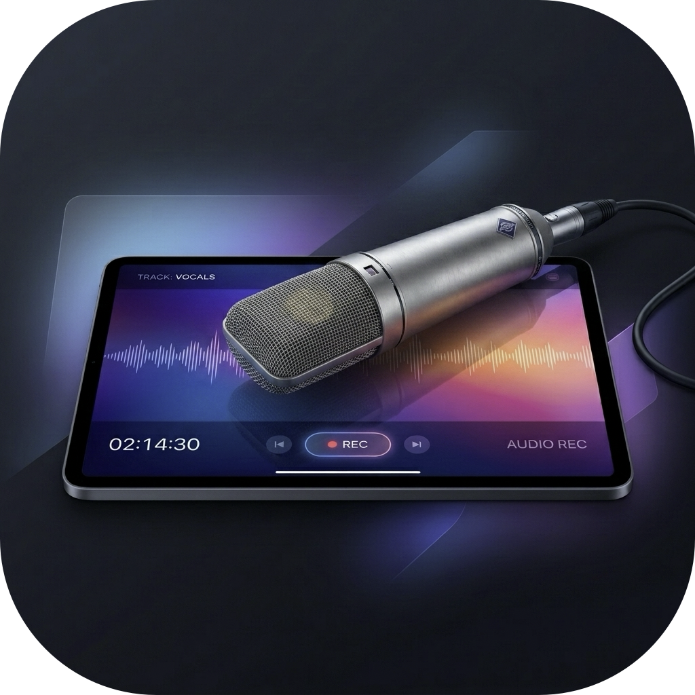

# 🎧 iMic (Bluetooth Sound Guard)

<p align="center">
  
  <br>
  <h2 align="center">"당신의 에어팟에 음질의 자유를."</h2>
  <p align="center"><i>Free your AirPods audio from 16kHz voice-call degradation.</i></p>
</p>

<p align="center">
  
  
  
  
</p>

---

### 🧐 왜 만들었나요? (The Problem)

에어팟이나 블루투스 헤드셋을 착용하고 **디스코드, 줌(Zoom), 온라인 게임, 화상회의**를 켜는 순간, 40만 원짜리 에어팟의 소리가 **20년 전 16kHz 모노(동굴/전화기 음질)로 떡락**하는 고질적인 현상을 겪어보셨을 겁니다.

* **원인**: 블루투스 대역폭 한계로 인해, 마이크가 켜지는 순간 음악 모드(A2DP)에서 통화 모드(HFP/SCO)로 강제 다운그레이드되기 때문입니다.
* **특히 데스크탑 맥(Mac mini, Mac Studio)**: 본체에 자체 내장 마이크가 아예 없어 비싼 외장 마이크를 추가로 사지 않는 이상 이 문제를 피하기 어렵습니다.

> **"맥 옆에 늘 꽂혀있는 아이패드나 아이폰의 스튜디오급 마이크를 맥용 유선 마이크로 쓸 수 없을까?"**
> 
> 이 고민에서 출발하여 무거운 서드파티 드라이버나 단축어 없이 100% 자체 동작하는 **초경량 순수 네이티브 macOS 메뉴바 앱 `iMic`**을 개발했습니다.

---

### ✨ 핵심 기능 (Key Features)

```mermaid
flowchart LR
    A[🎧 에어팟/BT 착용 감지] --> B[⚡ iMic 자동 개입]
    B --> C[📱 아이패드 IDAM 활성화 / 아이폰 감지]
    C --> D[🎙️ 마이크만 유선으로 가로채기]
    D --> E[✨ 에어팟 HiFi 스테레오 유지!]
